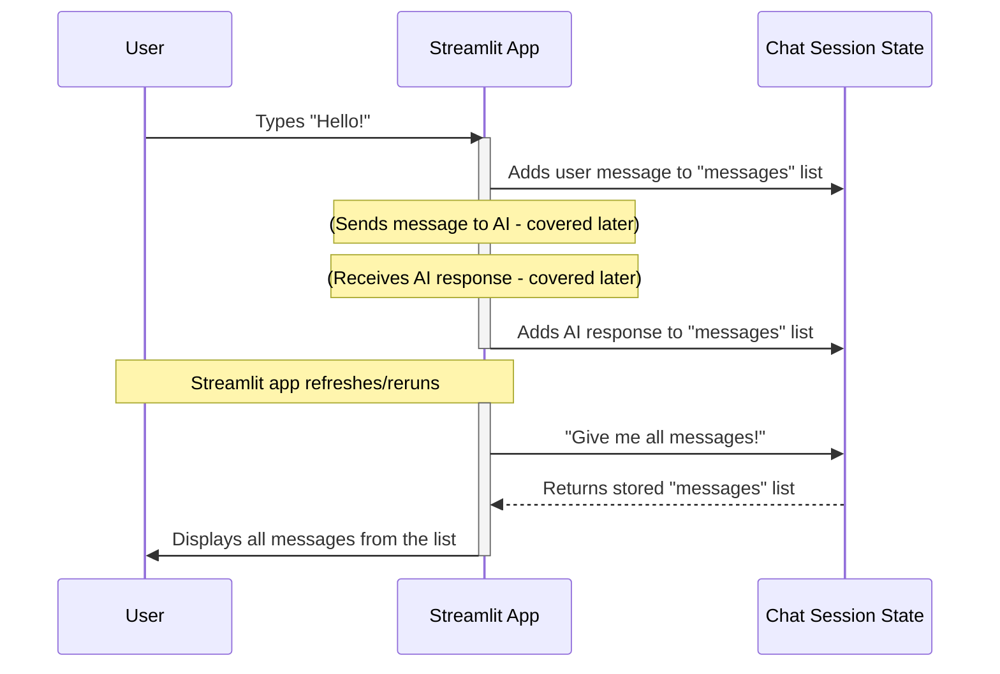

## Why Does a Chatbot Need Memory?

Think about using a chat app on your phone. When you close the app and open it again, or even when you just send a message, you expect to see the whole conversation still there. If it disappeared every time you sent a message or refreshed the page, it wouldn't be much of a chat!

Our `vedix` chatbot, which uses a tool called Streamlit, faces a similar challenge. Every time you interact with a Streamlit app (like sending a message), the entire app actually restarts and reruns its code from the top. Without a special way to remember things, all the previous messages would vanish!

The **Chat Session State** solves this problem by acting like a persistent notepad for our chatbot. It's where every message, both from you (the user) and the AI assistant, is written down and stored so that it doesn't get forgotten when the app reruns.

## Introducing `st.session_state`

Streamlit provides a special feature called `st.session_state`. You can think of `st.session_state` as a magical **storage box** that belongs to your current chat session. Anything you put inside this box will stick around, even if the Streamlit app reruns.

Inside this `st.session_state` box, we create a specific item named `messages`. This `st.session_state.messages` is like a **list** (similar to a shopping list) where we keep all the messages of our chat. Each item in this list is a message, containing:

*   **`role`**: Who sent the message (e.g., "user" for you, "assistant" for the AI).
*   **`content`**: The actual text of the message.

Let's look at how we prepare this "memory" in our `main.py` file:

```python
import streamlit as st

# ... other setup code ...

if "messages" not in st.session_state:
    st.session_state.messages = []
```

**What's happening here?**

1.  `import streamlit as st`: This line brings in the Streamlit library, giving us access to tools like `st.session_state`.
2.  `if "messages" not in st.session_state:`: This checks if our `messages` list already exists in our `st.session_state` storage box.
3.  `st.session_state.messages = []`: If it doesn't exist (which happens when the app starts for the very first time), we create an empty list called `messages` inside our storage box. This empty list is our chatbot's fresh memory!

## How the Chat Memory Works

Let's walk through the steps of how `st.session_state.messages` helps our chat remember everything:



Here's how this plays out in the code:

### 1. Showing Past Messages

Every time the Streamlit app runs (which happens when you send a message or refresh the page), the first thing it does is look into `st.session_state.messages` to see if there are any old messages. If there are, it displays them on the screen.

```python
for msg in st.session_state.messages:
    with st.chat_message(msg["role"]):
        st.markdown(msg["content"])
```

**What's happening here?**

1.  `for msg in st.session_state.messages:`: This loop goes through each message (`msg`) that is currently stored in our `messages` list.
2.  `with st.chat_message(msg["role"]):`: This tells Streamlit to display the message in a chat bubble, styled differently depending on if it's from the "user" or "assistant".
3.  `st.markdown(msg["content"])`: This actually puts the message text onto the screen.

This simple loop is the magic that makes your conversation history reappear every time!

### 2. Adding User Messages

When you type something into the chat input box and press Enter, your message needs to be added to our `st.session_state.messages` list so it's remembered for later.

```python
# prompt is the text the user typed
prompt = st.chat_input("Enter your prompt here...")

if prompt:
    st.session_state.messages.append({"role": "user", "content": prompt})
    # ... (code to send prompt to AI model, covered in later chapters) ...
```

**What's happening here?**

1.  `prompt = st.chat_input(...)`: This is where Streamlit creates the input box for you to type your message.
2.  `if prompt:`: This checks if you actually typed something and pressed Enter.
3.  `st.session_state.messages.append(...)`: If you did, your message is added to the end of our `messages` list. We store it as a dictionary with `"role": "user"` and its actual text as `"content": prompt`.

### 3. Adding AI Responses

Similarly, after the chatbot generates a response (we'll learn how that happens in later chapters!), its reply also needs to be saved into our `st.session_state.messages` list.

```python
# ... (code to get full_response from AI model, covered in later chapters) ...

        st.session_state.messages.append(
            {"role": "assistant", "content": full_response}
            )
```

**What's happening here?**

1.  `st.session_state.messages.append(...)`: Once we have the complete response from the AI (`full_response`), we add it to our `messages` list. This time, its role is `"assistant"`.

## Summary

The `Chat Session State`, specifically implemented using `st.session_state.messages`, is the core mechanism that gives our chatbot its "memory." It's a simple list that stores every interaction, ensuring that the entire conversation history can be retrieved and displayed whenever the Streamlit application reruns. Without it, our chatbot would forget everything after each message!

Now that we understand how the chatbot remembers what we say, let's move on to how these messages are actually displayed on the screen in a friendly chat interface.

[Next Chapter: Streamlit Chat Interface](02_streamlit_chat_interface_.md)

---
