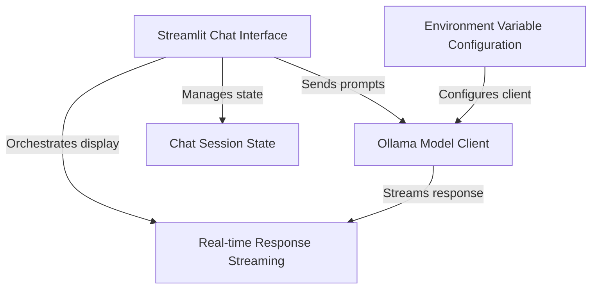

# vediX

This project, *vediX*, creates a user-friendly **Streamlit chatbot** that allows you to have real-time conversations with an **Ollama large language model**. It provides an intuitive interface where you can type your questions, see previous messages, and watch the AI's responses appear word by word, making the interaction feel highly responsive and engaging.

## Visual Overview

## Chapters

1. [Chat Session State](Chat_Session_State.md)
2. [Streamlit Chat Interface
](02_streamlit_chat_interface_.md)
3. [Ollama Model Client
](03_ollama_model_client_.md)
4. [Real-time Response Streaming
](04_real_time_response_streaming_.md)
5. [Environment Variable Configuration
](05_environment_variable_configuration_.md)

---
