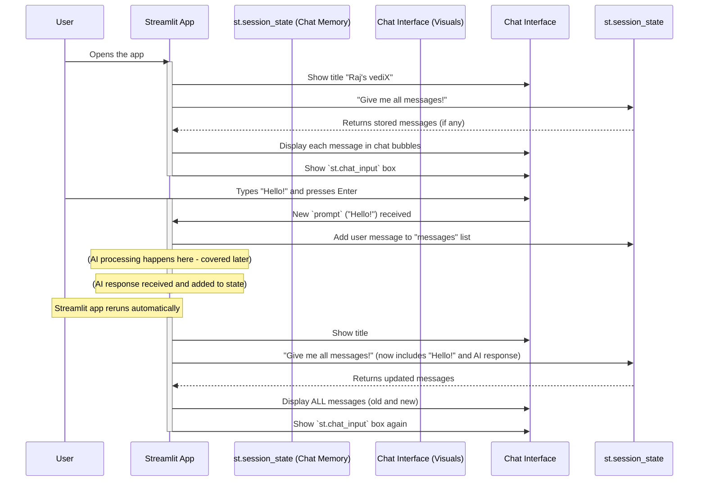

# 2: Streamlit Chat Interface

Welcome back! In the [previous chapter](Chat_Session_State.md), we learned all about the chatbot's "memory" – how it uses `st.session_state.messages` to remember our conversation history. But remembering messages is only half the story! What good is a memory if you can't see or interact with it?

This chapter is all about the **Streamlit Chat Interface**. Think of it as the friendly "front desk" of our chatbot. It's the visual part of the `vedix` application where you see the chat title, read past messages displayed neatly, and type your new questions or prompts. Essentially, it's how you *see* and *talk* to our chatbot.

## Why Do We Need a Chat Interface?

Imagine having a great conversation with a friend, but instead of seeing their face and hearing their voice, you just had a notepad where messages appeared and disappeared! That wouldn't be very engaging, would it?

Our chatbot needs a user-friendly interface to:

1.  **Display the conversation:** Show all the messages, both yours and the AI's, in a clear, easy-to-read format, just like a chat app.
2.  **Allow user input:** Provide a simple way for you to type your questions and send them to the chatbot.
3.  **Make it feel natural:** Create an experience that feels like you're talking to someone, with distinct bubbles for different speakers.

Streamlit is an amazing tool that makes building these interactive web applications incredibly simple, even if you have no web development experience!

## Core Components of Our Chat Interface

Let's break down the main parts of our `vedix` chat interface, which you can find in the `main.py` file.

### 1. Setting the Chat Window Title with `st.title()`

Every good application needs a name! Streamlit lets us easily set the title that appears at the top of our chat window.

```python
import streamlit as st

# ... other setup code ...

st.title("Raj's vediX")
```

**What's happening here?**

*   `st.title("Raj's vediX")`: This simple line tells Streamlit to display "Raj's vediX" as the main title at the very top of your web application. It's the first thing you see when you open the chatbot!

### 2. Displaying Past Messages with `st.chat_message()` and `st.markdown()`

This is where our chatbot's memory ([Chat Session State](01_chat_session_state_.md)) comes to life! We retrieve the stored messages and show them on the screen in a conversation-like format.

```python
# From Chapter 1: We loop through our remembered messages
for msg in st.session_state.messages:
    # Use st.chat_message to create a chat bubble
    with st.chat_message(msg["role"]):
        # Display the message content inside the bubble
        st.markdown(msg["content"])
```

**What's happening here?**

1.  `for msg in st.session_state.messages:`: We learned in [Chapter 1: Chat Session State](01_chat_session_state_.md) that `st.session_state.messages` holds all our past messages. This loop goes through each message one by one.
2.  `with st.chat_message(msg["role"]):`: This is a special Streamlit command that creates a visually distinct "chat bubble." The `msg["role"]` (which will be "user" or "assistant") tells Streamlit how to style the bubble. For example, "user" messages might appear on the right, and "assistant" messages on the left, often with different icons.
3.  `st.markdown(msg["content"])`: Inside that chat bubble, this command displays the actual text of the message (`msg["content"]`). `st.markdown` allows for basic text formatting like bold or italics if the content contains Markdown syntax.

This combination ensures that every time the app runs, your entire chat history is neatly drawn on the screen!

### 3. Getting New User Input with `st.chat_input()`

Finally, for you to talk to the chatbot, we need an input box!

```python
# This creates the input box at the bottom of the chat
prompt = st.chat_input("Enter your prompt here...")

if prompt:
    # If the user typed something and pressed Enter,
    # we add it to our chat memory (as seen in Chapter 1)
    st.session_state.messages.append({"role": "user", "content": prompt})
    # ... (the rest of the code to send this prompt to the AI is in later chapters) ...
```

**What's happening here?**

1.  `prompt = st.chat_input("Enter your prompt here...")`: This line creates the input box at the bottom of your Streamlit application, ready for you to type. The text "Enter your prompt here..." is a placeholder guiding you on what to do. When you type something and press Enter, that text becomes the value of the `prompt` variable.
2.  `if prompt:`: This checks if you've actually typed something and hit Enter. If you just open the app or haven't typed yet, `prompt` will be empty.
3.  `st.session_state.messages.append(...)`: If there's a `prompt`, we immediately save it into our chat memory, `st.session_state.messages`, with the role `"user"`. This ensures your message isn't forgotten when the app reruns!

## How the Chat Interface Works Together

Let's visualize the flow of how these interface components work with our chatbot's memory to create a smooth user experience.



This diagram shows how the Streamlit App continuously reads from `st.session_state` to display the entire conversation and then writes back to `st.session_state` when you send a new message. The Chat Interface is the visual layer that makes all this remembering and input-taking user-friendly!

## Summary

The **Streamlit Chat Interface** is the visual gateway to our `vedix` chatbot. It uses simple Streamlit commands like `st.title()`, `st.chat_message()`, `st.markdown()`, and `st.chat_input()` to:

*   Give our application a clear name.
*   Display the entire conversation history in an intuitive chat-like format, using the memory provided by [Chapter 1: Chat Session State](01_chat_session_state_.md).
*   Provide an easy way for users to type and send their prompts to the chatbot.

With the memory and the interface now in place, our chatbot can remember conversations and show them to us. But how does it actually *think* and generate responses? That's what we'll explore in the next chapter!

[Next Chapter: Ollama Model Client](Ollama_Model_Client.md)

---
